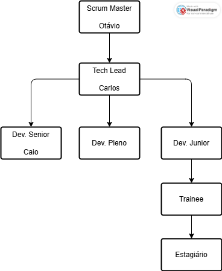

# 🚚 SA-LOGÍSTICA

Sistema de Planejamento e Monitoramento de Entregas.

---

## 📊 Estrutura Organizacional

---

## 🧩 Business Model Canvas
🔗 https://canva.link/4ywbf9q97dq1mel

---

## 🌍 Área de Atuação
Logística e Entregas.

---

## ⚠️ Problema
Atraso nas entregas e falta de planejamento de rotas.

---

## 💡 Solução
Sistema de Planejamento e Monitoramento de Entregas:

- Organização de pedidos  
- Definição automática de rotas  
- Monitoramento em tempo real das entregas  
- Controle e Gerenciamento de Estoque

---
